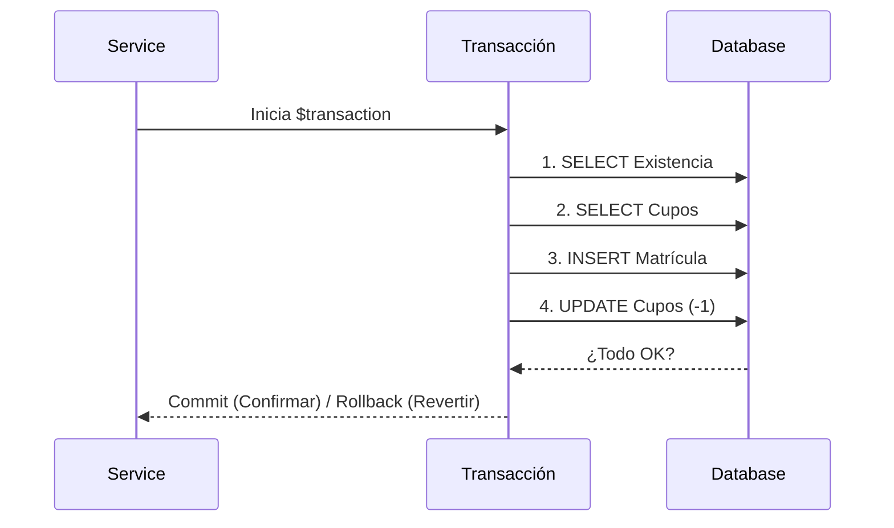

# Documento de Evaluación: Prueba Parte 1

Este documento consolida los conceptos, comandos, explicaciones de código y flujos de datos para las cinco áreas fundamentales de persistencia en NestJS con Prisma.

---

## 🚀 1. Consultas Derivadas en NestJS (ORM)

**¿Qué son?**
Son consultas generadas automáticamente por el ORM (Prisma) basándose en los nombres de los métodos y las definiciones del esquema. No requieren escribir SQL manualmente.

### 💻 Comando PowerShell
```powershell
Invoke-RestMethod -Method Get -Uri "http://localhost:3000/academic/students/status/active"
```

### 🛠️ Explicación del Código y Funcionalidad
- **Método Utilizado:** `findMany` con la propiedad `include`.
- **Qué hace:** Filtra estudiantes donde `isActive` es `true` y realiza un "Eager Loading" (carga inmediata) de la entidad `career`.
- **Ubicación:** `student.service.ts` -> `findActiveWithCareer`.

### 🔄 Flujo de Datos
1. **Request:** El controlador recibe la petición GET.
2. **Service:** Llama a `this.dataService.student.findMany`.
3. **ORM:** Prisma traduce el objeto de JavaScript a un comando SQL `SELECT ... JOIN ...`.
4. **Respuesta:** Devuelve un JSON estructurado con el estudiante y su carrera anidada.

---

## 🔍 2. Consultas Nativas en NestJS (SQL Puro)

**¿Qué son?**
Son consultas escritas en lenguaje SQL estándar que se envían directamente al motor de la base de datos PostgreSQL. Se usan cuando el ORM es limitado para tareas complejas.

### 💻 Comando PowerShell
```powershell
Invoke-RestMethod -Method Get -Uri "http://localhost:3000/academic/enrollments/report/native-stats"
```

### 🛠️ Explicación del Código y Funcionalidad
- **Método Utilizado:** `$queryRaw`.
- **Qué hace:** Ejecuta una consulta compleja con `COUNT`, `JOIN` (estudiantes + carreras + matrículas), `GROUP BY` y concatenación de strings (`||`). Genera un reporte resumido de carga académica.
- **Ubicación:** `enrollment.service.ts` -> `getNativeStudentReport`.

### 🛡️ Seguridad
Se usan **Tagged Templates** (`$queryRaw` + backticks) para prevenir inyecciones SQL mediante la parametrización automática de variables.

---

## 🧠 3. Operaciones Lógicas en NestJS (AND, OR, NOT)

**¿Qué son?**
Es el uso de operadores booleanos dentro de las cláusulas del ORM para combinar múltiples condiciones de filtrado.

### 💻 Comando PowerShell
```powershell
Invoke-RestMethod -Method Get -Uri "http://localhost:3000/academic/students/search/advanced?careerId=1&periodId=1"
```

### 🛠️ Explicación del Código y Funcionalidad
- **Operador:** `AND`.
- **Qué hace:** Busca estudiantes que cumplan tres condiciones simultáneas: 1) Estar activo, 2) Pertenecer a la carrera X, 3) Tener al menos una matrícula en el período Y.
- **Ubicación:** `student.service.ts` -> `searchAdvanced`.

---

## 🛡️ 4. Operaciones Transaccionales en NestJS

**¿Qué son?**
Es un mecanismo que agrupa varias operaciones de base de datos para que se ejecuten como una sola. Si una falla, todas se revierten (**Rollback**).

### 💻 Comando PowerShell
```powershell
$body = @{ studentId = 1; subjectId = 1; academicPeriodId = 1 } | ConvertTo-Json
Invoke-RestMethod -Method Post -Uri "http://localhost:3000/academic/enrollments" -Body $body -ContentType "application/json"
```

### 🛠️ Explicación del Código y Funcionalidad
- **Método Utilizado:** `$transaction`.
- **Qué hace:** 1) Valida si el alumno existe y está activo, 2) Verifica cupos de la materia, 3) Crea la matrícula, 4) Descuenta el cupo de la materia. Si falla el descuento de cupo, la matrícula no se guarda.
- **Ubicación:** `enrollment.service.ts` -> `create`.

### 🔄 Flujo de Datos (Transacción)


---

## 💎 5. Principios ACID aplicados a NestJS

Las transacciones implementadas garantizan:

1.  **Atomicidad (Atomicity):** El proceso de matriculación es "todo o nada". No puede haber matrícula sin descuento de cupo.
2.  **Consistencia (Consistency):** Las reglas de negocio (ej. no matricularse dos veces en lo mismo) se validan antes de persistir, manteniendo la DB en un estado válido.
3.  **Aislamiento (Isolation):** Dos matrículas simultáneas no pueden "robarse" el último cupo; PostgreSQL gestiona el acceso concurrente de forma aislada.
4.  **Durabilidad (Durability):** Una vez que el sistema responde 201 Created, los datos están grabados permanentemente en el disco duro, incluso si el servidor se apaga después.

---

## 📝 Resumen del Flujo General de Datos

1. **Cliente:** Envía petición (PowerShell/Postman) con parámetros o JSON.
2. **Controller:** Capta la petición, valida los tipos de datos (DTOs) y llama al Service.
3. **Service:** Aplica la lógica (Consultas ORM, Nativas o Transacciones).
4. **DataService (Prisma):** Se comunica con PostgreSQL usando SQL.
5. **Database:** Ejecuta, valida restricciones y devuelve el resultado.
6. **Controller:** Responde al cliente con un código HTTP (200 OK, 201 Created, 409 Conflict, 500 Error).
