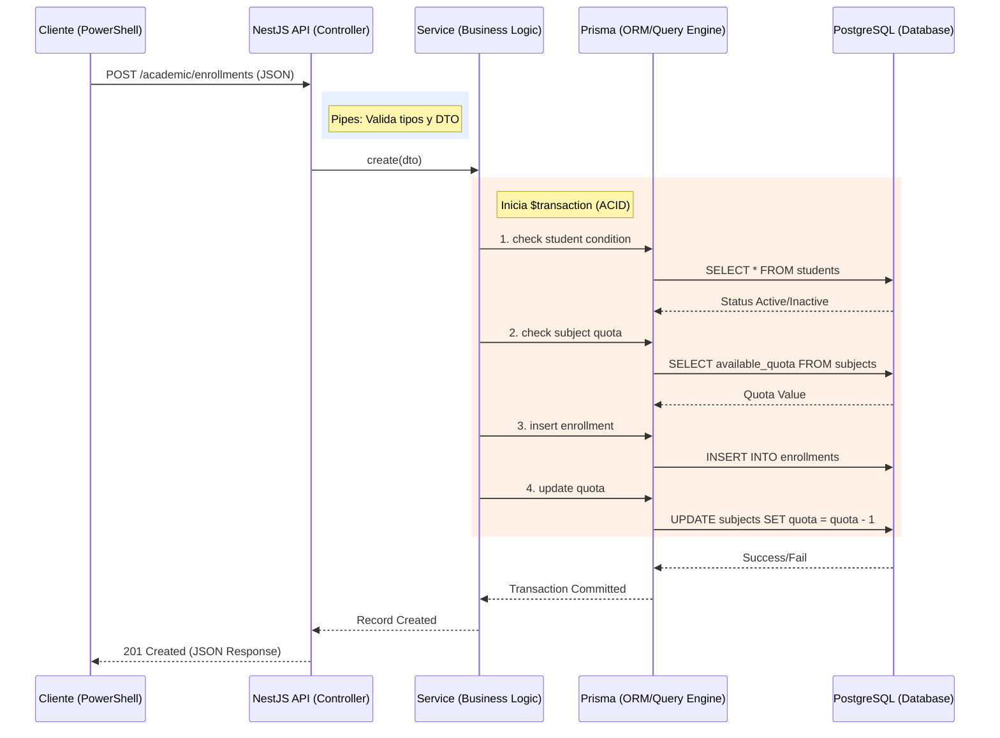

# Resumen General de Documentación y Flujo de Datos

Este documento sirve como índice maestro y resumen ejecutivo de toda la documentación técnica generada para el sistema académico. Consolida el conocimiento de los 12 documentos creados para facilitar el estudio y la presentación del proyecto.

---

## 📚 Índice de Documentos (Resumen Ejecutivo)

### 🛠️ Guías de Operación
1.  **[Guia_Comandos_PowerShell.md](file:///c:/dev/reinicio_uni/instructivo%20y%20material%20de%20apoyo/Guia_Comandos_PowerShell.md):** Fundamentos de Git, NPM y comandos básicos del entorno.
2.  **[Guia_Comandos_Consultas.md](file:///c:/dev/reinicio_uni/instructivo%20y%20material%20de%20apoyo/Guia_Comandos_Consultas.md):** Catálogo de comandos para probar cada endpoint del sistema.
3.  **[Historial_de_Consultas.md](file:///c:/dev/reinicio_uni/instructivo%20y%20material%20de%20apoyo/Historial_de_Consultas.md):** Bitácora cronológica de todas las pruebas y cambios realizados.

### 🔬 Explicaciones por Componente
4.  **[Explicacion_Consultas_Derivadas.md](file:///c:/dev/reinicio_uni/instructivo%20y%20material%20de%20apoyo/Explicacion_Consultas_Derivadas.md):** Detalle de la Parte 1 (ORM `findMany`).
5.  **[Explicacion_Operaciones_Logicas.md](file:///c:/dev/reinicio_uni/instructivo%20y%20material%20de%20apoyo/Explicacion_Operaciones_Logicas.md):** Detalle de la Parte 2 (Filtrado con AND/OR/NOT).
6.  **[Explicacion_Consultas_Nativas.md](file:///c:/dev/reinicio_uni/instructivo%20y%20material%20de%20apoyo/Explicacion_Consultas_Nativas.md):** Detalle de la Parte 3 (SQL Puro `$queryRaw`).
7.  **[Explicacion_Transacciones_Matriculacion.md](file:///c:/dev/reinicio_uni/instructivo%20y%20material%20de%20apoyo/Explicacion_Transacciones_Matriculacion.md):** Detalle de la Parte 4 (Atómica con `$transaction`).

### 🛡️ Análisis y Arquitectura
8.  **[Analisis_ACID_Matriculacion.md](file:///c:/dev/reinicio_uni/instructivo%20y%20material%20de%20apoyo/Analisis_ACID_Matriculacion.md):** Justificación teórica de la integridad de datos.
9.  **[Revision_Flujo_Completo.md](file:///c:/dev/reinicio_uni/instructivo%20y%20material%20de%20apoyo/Revision_Flujo_Completo.md):** Análisis de la ruta de una petición (Request -> Response).
10. **[Como_Encontrar_Endpoints.md](file:///c:/dev/reinicio_uni/instructivo%20y%20material%20de%20apoyo/Como_Encontrar_Endpoints.md):** Guía visual para navegar por el código fuente de NestJS.

### 🎤 Material de Defensa
11. **[Guia_Explicacion_Verbal.md](file:///c:/dev/reinicio_uni/instructivo%20y%20material%20de%20apoyo/Guia_Explicacion_Verbal.md):** Guión y puntos clave para explicar el proyecto al ingeniero.
12. **[Referencia_Ubicacion_Codigo.md](file:///c:/dev/reinicio_uni/instructivo%20y%20material%20de%20apoyo/Referencia_Ubicacion_Codigo.md):** Mapa exacto de archivos y líneas de código por cada funcionalidad.

---

## 🔄 Flujo de Datos del Sistema

El siguiente diagrama representa cómo viaja la información en una operación crítica (como la matriculación):

### Capas del Flujo de Datos:

1.  **Capa de Entrada (Request):** El cliente envía parámetros vía URL (`Params`, `Query`) o cuerpo de mensaje (`Body`).
2.  **Capa de Validación (Controller/Pipes):** Se asegura que los datos sean del tipo correcto y existan.
3.  **Capa de Negocio (Service):** Aplica las reglas lógicas (¿Tiene cupo? ¿Está activo? ¿Es duplicado?).
4.  **Capa de Persistencia (Prisma/DB):** Traduce las acciones a SQL y las ejecuta de forma atómica en PostgreSQL.
5.  **Capa de Respuesta (Response):** Devuelve el resultado formateado al cliente con el código de estado HTTP apropiado (200, 400, 409, 500).

---

## 💡 Recomendación de Uso
Para una máxima efectividad en la presentación, mantén el documento **[Referencia_Ubicacion_Codigo.md](file:///c:/dev/reinicio_uni/instructivo%20y%20material%20de%20apoyo/Referencia_Ubicacion_Codigo.md)** abierto en VSCode y este **Resumen General** como guía de navegación.
